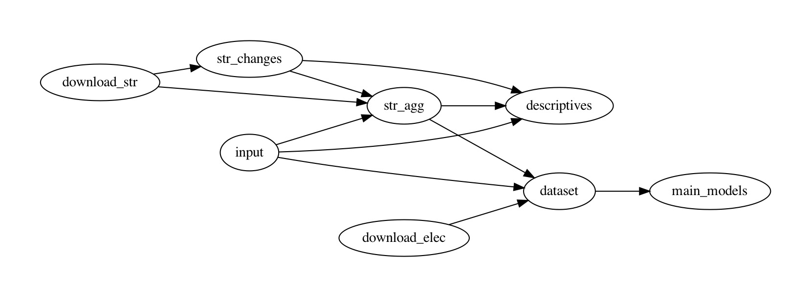

Replication files for 'Do TJ policies cause backlash? Evidence from street name changes in Spain,' by [Francisco Villamil](https://franvillamil.github.io) and [Laia Balcells](https://www.laiabalcells.com).

> Memories of old conflicts often shape domestic politics long after these conflicts end. Contemporary debates about past civil wars and/or repressive regimes in different parts of the world suggest that these are sensitive topics that might increase political polarization, particularly when transitional justice policies are implemented and political parties mobilize discontentment with such policies. One such policy recently debated in Spain is removing public symbols linked to a past civil war and subsequent authoritarian regime (i.e., Francoism). However, the empirical evidence on its impact is still limited. This article attempts to fill this gap by examining the political consequences of street renaming. Using a difference-in-differences approach, we show that the removal of Francoist street names has contributed to an increase of electoral support for a new far-right party, Vox, mainly at the expense of a traditional right-wing conservative party, PP. Our results suggest that revisiting the past can cause a backlash among those ideologically aligned with the perpetrator, and that some political parties can capitalize on this.

[Google Scholar page](https://scholar.google.com/citations?view_op=view_citation&hl=en&user=G10YqfQAAAAJ&authuser=1&citation_for_view=G10YqfQAAAAJ:qjMakFHDy7sC)

```
@article{villamilbalcells2021,
  title={Do TJ policies cause backlash? Evidence from street name changes in Spain},
  author={Villamil, Francisco and Balcells, Laia},
  journal={Research \& Politics},
  year={2021},
  volume={},
  issue={},
  pages={}
}
```

### Instructions

The code in this repository is organized in tasks, each in one folder. Some tasks are dependent on the output of previous tasks:



There are two options to replicate the results:

1. Download the whole repository and run each file separately. The taskflow graph above helps identifying which scripts should be run first.
2. From the command line (Unix/macOS), you can do a full replication from scratch using the following script, which downloads the repository, cleans up all output files, and runs all scripts again:

```shell
git clone https://github.com/franvillamil/streets_vox
cd streets_vox
make clean
make
```

In addition to `R`, you need to have `git` and [pdfcrop](https://manpages.ubuntu.com/manpages/precise/man1/pdfcrop.1.html) installed.
