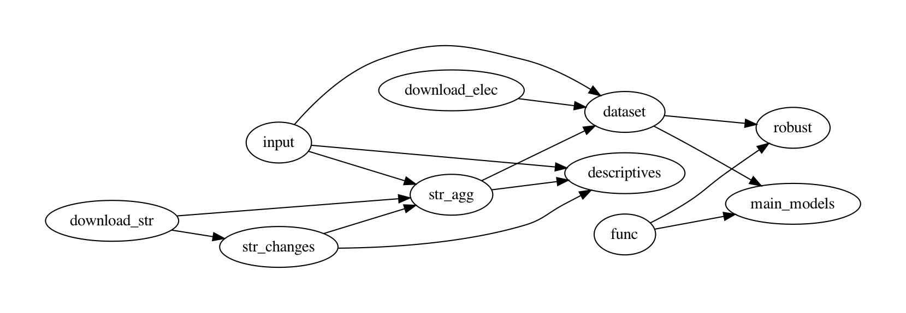

Replication files for '[Do TJ policies cause backlash? Evidence from street name changes in Spain](http://web.isanet.org/Web/Conferences/ISA2021/Archive/6611cf58-9c8d-4d5f-b04e-b1fdf32c2c41.pdf),' by [Francisco Villamil](https://franvillamil.github.io) and [Laia Balcells](https://www.laiabalcells.com).

> Memories of old conflicts shape domestic politics long after these conflicts end. The debates about the Confederacy in the United States or the Francoist regime in Spain suggest that these are sensitive topics that might increase political polarization, particularly when transitional justice policies are implemented to address grievances. One such policy recently debated in the US and Spain is the removal of public symbols linked to past conflicts and authoritarian regimes. However, the empirical evidence on their impact is still limited. This article attempts to fill this gap by exploring the impact of removing Francoist street names in Spain. Using cross-sectional and difference-in-differences analyses, we show that removing Francoist street names has increased electoral support to the new far-right party, Vox. Results suggest that revisiting the past and trying to redress the victims’ grievances can cause a backlash among those ideologically aligned with the perpetrator.

**Taskflow**



### Instructions

There are two options to replicate the results:

1. Download the whole repository and run each file separately. The taskflow graph above helps identifying which scripts should be run first.
2. From the command line (Unix/macOS), you can do a full replication from scratch using the following script, which downloads the repository, cleans up all output files, and runs all scripts again:

```shell
git clone https://github.com/franvillamil/cuarteles_militares
cd cuarteles_militares
make clean
make
```

In addition to `R`, you need to have `git` and [pdfcrop](https://manpages.ubuntu.com/manpages/precise/man1/pdfcrop.1.html) installed.
